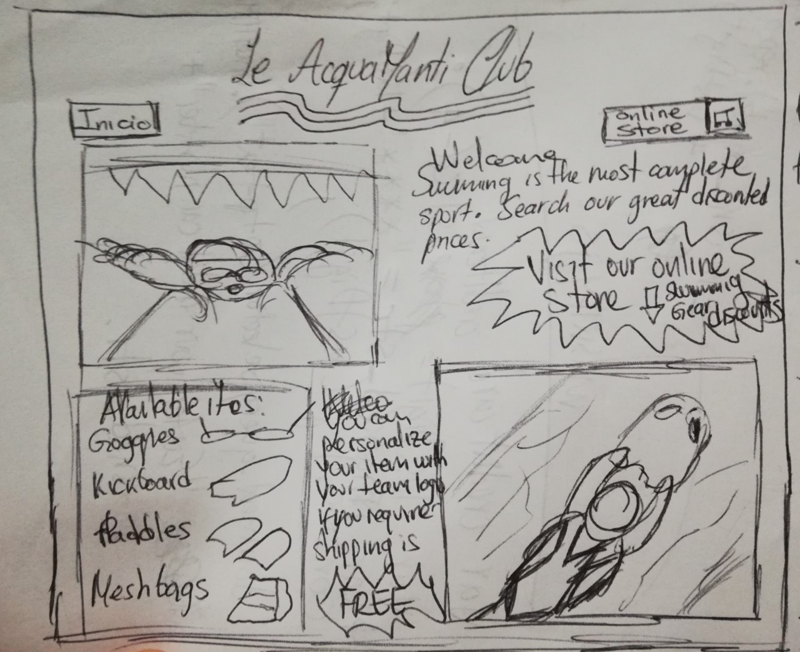
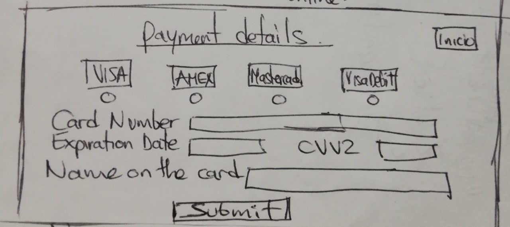

# Tarjeta de crédito válida


## Índice

* [1. Preámbulo](#1-preámbulo)
* [2. Resumen del proyecto](#2-resumen-del-proyecto)
* [3. Objetivos de aprendizaje](#3-objetivos-de-aprendizaje)
* [4. Consideraciones generales](#4-consideraciones-generales)
* [5. Criterios de aceptación mínimos del proyecto](#5-criterios-de-aceptación-mínimos-del-proyecto)
* [6. Pistas, tips y lecturas complementarias](#6-pistas-tips-y-lecturas-complementarias)

***

## 1. Preámbulo

El [algoritmo de Luhn](https://es.wikipedia.org/wiki/Algoritmo_de_Luhn),
también llamado algoritmo de módulo 10, es un método de suma de verificación,
se utiliza para validar números de identificación; tales como el IMEI de los
celulares, tarjetas de crédito, etc.

Pasos del algoritmo:
- Obtenemos la reversa del número a verificar (que solamente contiene dígitos [0-9])
- A todos los números que ocupan una posición par se les debe multiplicar por dos, si este número es mayor o igual a 10,
debemos sumar los dígitos del resultado
- El número a verificar será válido si la suma de sus dígitos finales es un múltiplo de 10.

## 2. Resumen del proyecto

En este proyecto tendrás que construir una aplicación web que le permita a un
usuario validar el número de una tarjeta de crédito. Además, tendrás que
implementar funcionalidad para ocultar todos los dígitos de una tarjeta menos
los últimos cuatro.

La temática es libre. Tú debes pensar en qué situaciones de la vida real se
necesitaría validar una tarjeta de crédito y pensar en cómo debe ser esa
experiencia de uso (qué pantallas, explicaciones, mensajes, colores, ¿marca?)
etc.

## 3. Objetivos de aprendizaje

Trabajando en parejas aprenderán a construir una aplicación web que interactuará
con lx usuarix final a través del navegador, utilizando HTML, CSS y JavaScript
como tecnologías.

Reflexiona y luego marca los objetivos que has llegado a **entender** y
**aplicar** en tu proyecto.

### UX

* [x] Diseñar la aplicación pensando y entendiendo al usuario
* [x] Crear prototipos para obtener feedback e iterar
* [x] Aplicar los principios de diseño visual

### HTML y CSS

* [x] Uso correcto de HTML semántico
* [x] Uso de selectores de CSS
* [ ] Construir tu aplicación respetando el diseño realizado (maquetación).

### DOM

* [x] Uso de selectores de nodos del DOM
* [x] Manejo de eventos del DOM
* [ ] Manipulación dinámica del DOM

### Javascript

* [x] Manipulación de strings
* [x] Uso de condicionales
* [x] Uso de bucles
* [x] Uso de funciones
* [ ] Datos atómicos y estructurados
* [x] Utilizar ES Modules (`import` | `export`).

### Testing

* [x] [Testeo de tus funciones](https://jestjs.io/docs/es-ES/getting-started)

### Git y GitHub

* [x] Comandos de git (`add` | `commit` | `pull` | `status` | `push`).
* [ ] Manejo de repositorios de GitHub (`clone` | `fork` | `gh-pages`).

### Buenas prácticas de desarrollo

* [x] Organizar y dividir el código en módulos (Modularización).
* [ ] Uso de identificadores descriptivos (Nomenclatura | Semántica).
* [x] Uso de linter para seguir buenas prácticas (ESLINT).

## 4. Consideraciones generales

* El equipo de coaches te dará un tiempo sugerido e indicaciones sobre si trabajar
  sola o en equipo. Recuerda que cada una aprende a diferente ritmo.
* El proyecto será entregado subiendo tu código a GitHub (commit/push) y la
  interfaz será desplegada usando GitHub pages. Si no sabes lo que es GitHub, no
  te preocupes, lo aprenderás durante este proyecto.

## 5. Criterios de aceptación mínimos del proyecto

Usa solo caracteres numéricos (dígitos) en la tarjeta a validar [0-9].


### User Interface (UI)

This interface should allow to the user:

* Insert the credit card number we want to validate.
* Show result if it is valid or not.
* Mask all credit card numbers except for the last 4 digits.
* No debe poder ingresar un campo vacío.

### User Experience Design (UX)

Before start coding, understand the problem and give a solution through the application.

* Do paper scketches (black and white).
* Ask for feedback to a teammember.
* Develop a prototype based on the paper scketches ([Balsamiq](https://balsamiq.com/), [Figma](https://www.figma.com/),
  [Google Slides](https://www.google.com/intl/es/slides/about/), etc.)
  


### Scripts / Archivos

#### General

##### `README.md`

* Project name: "LeManti"
* Summary: This project presents the user a Swimming Club called "Le AcquAmanti" which is launching its new swimming gear brand called "LeManti" available for online purchases as a solution for swimmers, club members/non-members to buy high quality items at low prices plus free shipping.
* Final Project Image 
* UX Investigation:
  ### Product Definition

How did you think about the users? 
Swimming is one of the best sports ever. As a swimmer when trying to purchase gear I found out there are multiple brands that are expensive and the low cost choices are not always the best durable or high quality products as they could be. So, the idea of a Swimming Club called "Le AcquAmanti" (Water Lovers in Italian) to launch its own brand "LeManti" for low cost and still high quality swimming gear is very interesting. There are lots of swimmers that would be really excited to enjoy this brand benefits and designs.  

What was your process to define the final product on UI and UX? 
First of all, it was extremely important to define who the user was and what was the benefit or solution they were looking for. Then based on that, create some sketches that were useful to show those ideas. When the idea was clear in head and paper, next was key to work on design a prototype (e.g. through Figma) on how this idea would be materialized on the application/website. Finally, coding through HTML, CSS and JavaScript to bring those ideas to life and assign functions and events to deliver the most accurate user interface and provide the best user experience since when we know the user being in their shoes, it is easier for us to relate with them and understand what they really need as well as being realistic about what we are able to offer them as a final product.  


* Who are the main users of this product?: The main users of this application/website are the Swimming instructors from the "Le AcquAmanti Club" and at the same time all swimmers club members/non-members that want to purchase high quality and still low cost swimming gear.

* Which are the users' objectives related to this product? The Club swimming instructors' main objective is to launch its new swimming gear brand called "LeManti" available for online purchases and free shipping with a variety of choices. 

* How do you think this product you are creating is solving the users' concerns?: This application/website is giving a solution when announcing the new brand online in order to become an alternative for swimmers to purchase anytime, anywhere while saving money and getting the best quality swimming gear at the same time. 

  3. Paper Sketch

  
  

  4. Feedback received: Organize interface to avoid everything gets on the principal page overwhelming the user with information on the main page. Create a list of products to give choices to the users. Use plain color in the a background instead of whole image to avoid losing customer focus on the letters and use the same font style through the titles and themes. 

  5. Final Prototype 
  
  https://www.figma.com/file/GG7jjyAUCbfLawQfKavBIE/Le-Manti?node-id=0%3A1

#### Visualmente (HTML y CSS)

Deberás maquetar de forma exacta el prototipo final que hiciste en la herramienta
de diseño de prototipos que escogiste utilizando HTML y CSS. En este momento elegirás
los colores, tipo de fuente, etc a usar.

A continuación describimos los archivos que utilizarás:

##### `src/index.html`

En este archivo va el contenido que se mostrará al usuario (esqueleto HTML).
Encontrarás 3 etiquetas iniciales, las cuales si deseas puedes borrar y empezar
de cero:

* `<header>`: encabezado de tu proyecto.
* `<main>`: contenido principal de tu proyecto.
* `<footer>`: pie de página de tu proyecto.

##### `src/style.css`

Este archivo debe contener las reglas de estilo. Queremos que escribas tus
propias reglas, por eso NO está permitido el uso de frameworks de CSS
(Bootstrap, materialize, etc).

#### Funcionalmente (JavaScript - pruebas unitarias)

* La lógica del proyecto debe estar implementada completamente en JavaScript.
* En este proyecto NO está permitido usar librerías o frameworks, sólo JavaScript
puro también conocido como Vanilla JavaScript.
* No se debe utilizar la _pseudo-variable_ `this`.

Vas a tener 2 archivos JavaScript separando responsabilidades, a continuación
indicamos qué harás en cada archivo:

##### `src/validator.js`

Acá escribirás las funciones necesarias para que el usuario pueda verificar la
tarjeta de crédito y ocultar los dígitos de su número de tarjeta.
Esta función debe ser pura e independiente del DOM.

Para esto debes implementar el **objeto `validator`**, el cual ya se encuentra
_exportado_ en el _boilerplate_. Este objeto (`validator`) contiene
dos métodos (`isValid` y `maskify`):

* **`validator.isValid(creditCardNumber)`**: `creditCardNumber` es un `string`
con el número de tarjeta que se va a verificar. Esta función debe retornar un
`boolean` dependiendo si es válida de acuerdo al [algoritmo de Luhn](https://es.wikipedia.org/wiki/Algoritmo_de_Luhn).

* **`validator.maskify(creditCardNumber)`**: `creditCardNumber` es un `string` con
el número de tarjeta y esta función debe retornar un `string` donde todos menos
los últimos cuatro caracteres sean reemplazados por un numeral (`#`) o 🐱.
Esta función deberá siempre mantener los últimos cuatro caracteres intactos, aún
cuando el `string` sea de menor longitud.

    Ejemplo de uso

    ```js
    maskify('4556364607935616') === '############5616'
    maskify(     '64607935616') ===      '#######5616'
    maskify(               '1') ===                '1'
    maskify(               '')  ===                ''
    ```

##### `src/index.js`

Acá escribirás todo el código que tenga que ver con la interacción del DOM
(seleccionar, actualizar y manipular elementos del DOM y eventos).
Es decir, en este archivo deberás invocar las funciones `isValid` y `maskify`
según sea necesario para actualizar el resultado en la pantalla (UI).

##### `test/validator.spec.js`

En este archivo tendrás que completar las pruebas unitarias de las funciones
`validator.isValid(creditCardNumber)` y `validator.maskify(creditCardNumber)`
implementadas en `validator.js` utilizando [Jest](https://jestjs.io/es-ES/).
Tus pruebas unitarias deben dar un 70% en _coverage_ (cobertura),
_statements_ (sentencias), _functions_ (funciones) y _lines_ (líneas); y un
mínimo del 50% de _branches_ (ramas).

***

## 6. Pistas, tips y lecturas complementarias

### Primeros pasos

1. Antes que nada, asegúrate de tener un :pencil: editor de texto en
  condiciones, algo como [Atom](https://atom.io/) o
  [Code](https://code.visualstudio.com/).
2. Para ejecutar los comandos a continuación necesitarás una :shell:
  [UNIX Shell](https://github.com/Laboratoria/bootcamp/tree/master/topics/shell),
  que es un programita que interpreta líneas de comando (command-line
  interpreter) así como tener [git](https://github.com/Laboratoria/bootcamp/tree/master/topics/scm/01-git)
  instalado. Si usas un sistema operativo "UNIX-like", como GNU/Linux o MacOS,
  ya tienes una _shell_ (terminal) instalada por defecto (y probablemente `git`
  también). Si usas Windows puedes usar la versión completa de [Cmder](https://cmder.net/)
  que incluye [Git bash](https://git-scm.com/download/win) y si tienes Windows 10
  o superior puedes usar [Windows Subsystem for Linux](https://docs.microsoft.com/en-us/windows/wsl/install-win10).
3. Una de las integrantes del equipo debe realizar un :fork_and_knife:
  [fork](https://help.github.com/articles/fork-a-repo/) del repo de tu cohort,
  tus _coaches_ te compartirán un _link_ a un repo y te darán acceso de lectura
  en ese repo. La otra integrante del equipo deber hacer un fork **del
  repositorio de su compañera** y
  [configurar](https://gist.github.com/BCasal/026e4c7f5c71418485c1) un `remote`
  hacia el mismo.
4. :arrow_down: [Clona](https://help.github.com/articles/cloning-a-repository/)
  tu _fork_ a tu computadora (copia local).
5. 📦 Instala las dependencias del proyecto con el comando `npm install`. Esto
  asume que has instalado [Node.js](https://nodejs.org/) (que incluye [npm](https://docs.npmjs.com/)).
6. Si todo ha ido bien, deberías poder ejecutar las :traffic_light:
  pruebas unitarias (unit tests) con el comando `npm test`.
7. Para ver la interfaz de tu programa en el navegador, usa el comando
  `npm start` para arrancar el servidor web y dirígete a
  `http://localhost:5000` en tu navegador.
8. A codear se ha dicho! :rocket:

### Recursos y temas relacionados

A continuación un video de Michelle que te lleva a través del algoritmo de Luhn
y un par de cosas más que debes saber para resolver este proyecto. ¡Escúchala
con detenimiento y sigue sus consejos! :)

[](https://www.youtube.com/watch?v=f0zL6Ot9y_w)

[Link](https://www.youtube.com/watch?v=f0zL6Ot9y_w)

Terminal y shell de UNIX:

[](https://www.youtube.com/playlist?list=PLiAEe0-R7u8nGH5TEHfSTeDNIvjZFe_Yd)

[Link](https://www.youtube.com/playlist?list=PLiAEe0-R7u8nGH5TEHfSTeDNIvjZFe_Yd)

Control de versiones y trabajo colaborativo con Git y GitHub:

[](https://www.youtube.com/playlist?list=PLiAEe0-R7u8k9o3PbT3_QdyoBW_RX8rnV)

[Link](https://www.youtube.com/playlist?list=PLiAEe0-R7u8k9o3PbT3_QdyoBW_RX8rnV)

Diseño de experiencia de usuario (User Experience Design):

* Ideación
* Prototipado (sketching)
* Testeo e Iteración

Desarrollo Front-end:

* Valores
* Tipos
* Variables
* Control de flujo
* Tests unitarios
* [Documentación de NPM](https://docs.npmjs.com/)

Organización del Trabajo:

* [Metodologías Ágiles](https://www.youtube.com/watch?v=v3fLx7VHxGM)
* [Scrum en menos de 2 minutos](https://www.youtube.com/watch?v=TRcReyRYIMg)
* [Scrum en Detalle](https://www.youtube.com/watch?v=nOlwF3HRrAY&t=297s). No
  esperamos que hagas todo eso desde este proyecto. Iremos profundizando poco a
  poco a lo largo del -_bootcamp_.
* [Blog: cómo funciona el algoritmo de Luhn](http://www.quobit.mx/asi-funciona-el-algoritmo-de-luhn-para-generar-numeros-de-tarjetas-de-credito.html).
